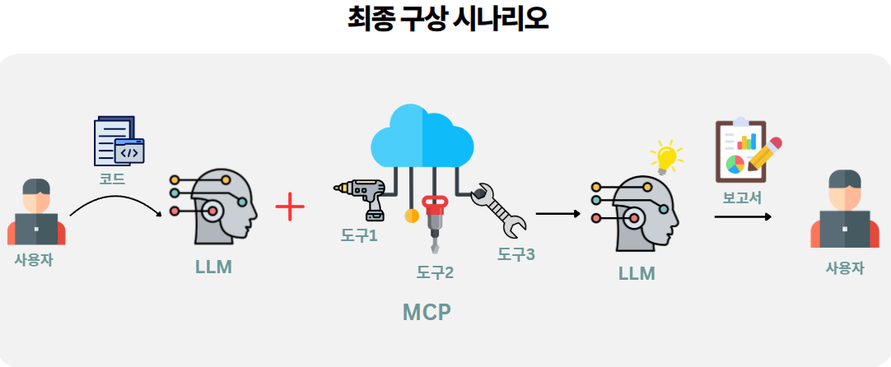

# 🚀 오픈소스 1조 프로젝트

**🎯 개발 목표:** 웹 취약점 진단 자동화 도구

**🛠️ 프로젝트 목표:**  
LLM과 MCP를 사용해 프론트엔드 소스코드 및 백엔드 소스코드를 **정적으로 분석**하여 취약점을 발견해주는 툴을 만드는 것입니다. 🔍💥

---

## ✨ 주요 기능(예시)
- 🔎 코드 정적 분석(프론트/백엔드)
- ⚠️ 취약점 패턴 탐지 (XSS, SQLi 등)
- 📄 자동 보고서 생성 (JSON / PDF)

## 사용 LLM
- Claude

## 구상 시나리오

## 사용 방법

- 준비 사항 분석할 코드들을 전부 한 폴더에 넣어둘 것!

1. ANTHROPIC_API_KEY = "YOUR_API_KEY" 부분에 본인의 API키를 첨부
2. 📁 분석할 프로젝트 폴더 경로를 입력하세요: "분석할 코드들이 있는 폴더 경로를 입력"
3. 📄 보고서 파일명을 입력하세요 : "보고서 파일명 입력 (주의! : 반드시 .HTML 형식으로 저장할 것)
4. 생성이 완료되면 분석 실행 시킨 main.py 폴더 안에 보고서가 생성
